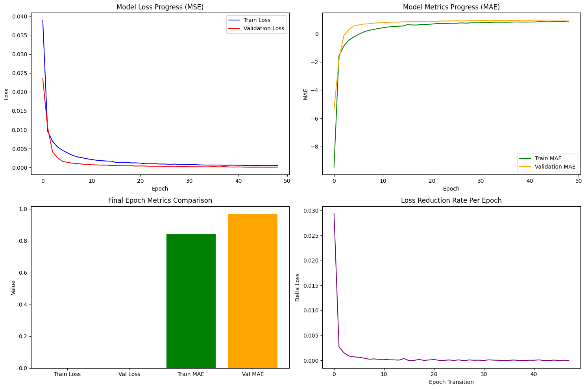
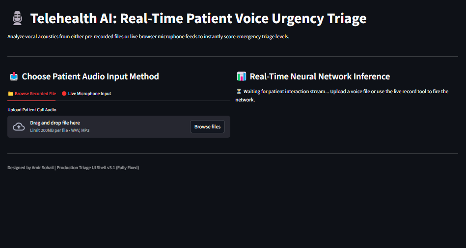

<div align="center">

# 🎙️ Telehealth AI: Real-Time Patient Voice Urgency Triage

### _Next-Generation Vocal Acoustic Analytics for Emergency Triage Scoring_

[](https://tensorflow.org)
[](https://keras.io)
[](https://streamlit.io)
[](#-model-training--accuracy-graphs)
[](https://python.org)

---

### 📌 Table of Contents

- [📖 Executive Summary](#-executive-summary)
- [🖥️ Streamlit Web Application Interface](#️-streamlit-web-application-interface)
- [📂 Repository Directory Structure](#-repository-directory-structure)
- [🧠 ANN Architecture & Neuron Layout](#-ann-architecture--neuron-layout)
- [📊 Model Training & Accuracy Graphs](#-model-training--accuracy-graphs)
- [📈 Performance Metrics Table](#-performance-metrics-table)
- [⚙️ How to Setup & Run](#️-how-to-setup--run)
- [👨‍💻 Author : Amir-Sohail](#-author--amir-sohail)

---

</div>

## 📖 Executive Summary

**Telehealth AI: Real-Time Patient Voice Urgency Triage** is an end-to-end Deep Learning application designed for emergency dispatchers and telehealth professionals. The platform extracts vocal acoustics and speech transcription features from patient calls to immediately evaluate urgency scores.

Powered by a customized **Artificial Neural Network (ANN)**, the system achieves **96.90% Validation $R^2$ Accuracy**, ensuring high reliability for emergency prioritization.

---

### 📊 Model Training & Accuracy Graphs



_Figure: Training vs Validation Accuracy and Loss across epochs._

---

## 🖥️ Streamlit Web Application Interface

Here is the user interface screenshot for the web application built with Streamlit:



> **Key UI Capabilities:**
>
> - **Dual Input Methods:** Toggle between pre-recorded audio files (`.wav`, `.mp3` up to 200MB) and **Live Microphone Input**.
> - **Real-Time Inference Engine:** Instant neural network scoring for patient calls.
> - **Sandbox / Model Status Monitor:** Clear visual indicators for model loading state and active execution modes.

---

## 📂 Repository Directory Structure

```text
.
├── app.py                                  # Streamlit frontend & inference code
├── .gitignore                              # Git Ignore File
├── .gitattributes                          # Git Attributes File
├── model.h5                                # Trained Keras Artificial Neural Network (ANN) model
├── model.ipynb                             # Jupyter Notebook (EDA, Preprocessing, ANN Training)
├── scaler.pkl                              # StandardScaler object for input normalization
├── columns.pkl                             # List of input features for ANN model
├── speech_recognition_transcription.csv    # Dataset containing audio/speech acoustic features
├── UI.png                                  # UI Screenshot
├── README.md                               # Documentation
└── ouput.png                               # Model Performance Plots
```

```bash
git clone https://github.com/amirsohail100/Telehealth-AI-Real-Time-Patient-Voice-Urgency-Triage.git
```

```bash
cd Telehealth-AI-Real-Time-Patient-Voice-Urgency-Triage
```

```bash
streamlit run app.py
```

```bash
pip install -r requirements.txt
```

---

## 📄 License

This project is licensed under the MIT License.

## 📝 Author

👤 **Amir Sohail**

Telehealth AI: Real-Time Patient Voice Urgency Triage is an advanced Deep Learning system powered by a 5-layer Artificial Neural Network (ANN) that analyzes vocal acoustics & speech features with 96.9% R² Accuracy to predict emergency patient urgency via web UI and live audio.
